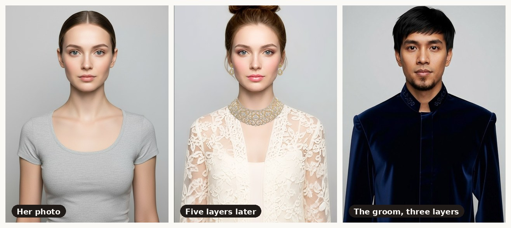
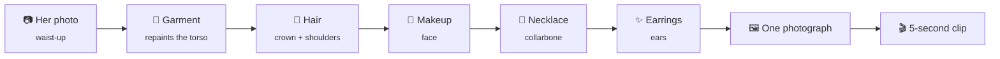

<div align="center">

# First Look

### See the wedding look before you pay for the trial.



<sub>Same face. Same light. Same crop. Five real try-ons, stacked onto one photograph — not a collage.</sub>

<br><br>

[**Live app**](https://first-look-five.vercel.app) ·
[Build a look](https://first-look-five.vercel.app/look) ·
[Hair readiness](https://first-look-five.vercel.app/readiness)

<sub>Built solo in four days for the DevNetwork [API + Cloud + AI] Hackathon 2026 — Perfect Corp track.</sub>

</div>

---

## The problem

A bridal trial in Jakarta costs **Rp 1.5–4 million and half a day**, and it
regularly ends in a look the bride does not want.

It is an ordering problem. The bride and her makeup artist work from Pinterest
screenshots of *other people's faces*, and the first moment they both see the
same thing is the trial itself — after the money is spent, at the point where
changing direction means starting over.

Underneath it sits a second failure nobody checks for. Bridal hairstyle
disasters are usually not a skill problem; they are a hair **condition**
problem — length, texture, damage. That gets discovered at the trial, weeks out,
when hair grows about 1.25 cm a month and there is no way to make up the gap.

---

## What it does

### 1 · Stack the look onto one photo

Kebaya, sanggul, makeup, necklace, earrings. Each try-on runs against the
**previous result** rather than the original photo, so what comes out is one
genuine photograph.

Order is not cosmetic. Every pass repaints a region and overwrites what is
underneath it, so the rule is *largest affected area first*:



Put the necklace before the kebaya and it simply disappears under it.

### 2 · A groom's path, not an afterthought

Beskap, haircut and beard, in the same order, with four regional garments —
Javanese, Sundanese, Minang, and a modern suit. The same batik parang runs
through her kebaya and his beskap, because that is how a Javanese couple
actually dresses.

### 3 · Hair Readiness — the part nobody else builds

Everyone points try-on at *"what would this look like?"*. This points hair
diagnostics at *"can her hair actually get there by the wedding?"* — a planning
question, not a retail one.

| Verdict | When | What she gets |
|---|---|---|
| 🟢 **Ready** | Length and texture already qualify | Go ahead |
| 🟡 **Ready with preparation** | Short of length, but there is time | A month-by-month plan |
| 🔴 **Not by then** | The gap does not close by that date | Alternatives her length already reaches |

Three diagnostics feed **our own rule layer** — every threshold is a named
constant with its reasoning attached, and the UI can show you which number
fired. A bride told "not by then" is owed the arithmetic that said so.

> The same measured bride produces **all three verdicts** depending on her date
> and her target. Nothing is faked.

---

## Measured, not estimated

Every number here was recorded against the live API.

| | |
|---:|:---|
| **31** | Perfect Corp APIs wired up, each verified by eye rather than by HTTP 200 |
| **5** | try-ons composited onto a single frame |
| **17** | Nusantara references — 12 regional garments across bride and groom, 5 regional makeup looks |
| **7.4 s** | average for one try-on call, upload to finished image |
| **0** | units the entire demo path costs, in production |

---

## Four things this codebase learned the hard way

Full detail in [`docs/FINDINGS.md`](docs/FINDINGS.md) — everything measured
against the live API that the documentation gets wrong or omits.

<table>
<tr><td width="50%" valign="top">

**Failure is billed.**
A task that is accepted and then fails still costs. So impossible combinations
are refused *in the browser*, before anything is uploaded — loose hair covers
the earlobes, and the earring endpoint fails **after** charging.

</td><td width="50%" valign="top">

**The catalogue has no kebaya.**
Audited: 3 bridal looks and 4 gowns, all Western. For a market that marries in
kebaya, songket and ulos that is an empty catalogue — so the localisation runs
through custom reference images instead.

</td></tr>
<tr><td width="50%" valign="top">

**One frame has to carry the chain.**
Full-body puts the face at ~75 px, under the API's 128 px minimum, so makeup,
hair and jewellery are all rejected on it. A face crop has no torso to dress.
Only waist-up satisfies both.

</td><td width="50%" valign="top">

**Asking for less motion produced more of it.**
A *"stands still, minimal motion"* video prompt measured **twice** the
frame-to-frame change of *"turns slowly"* — the model invents motion to fill
five seconds. Measured with [`scripts/measure-motion.py`](scripts/measure-motion.py).

</td></tr>
</table>

---

## How the zero-unit demo works

Perfect Corp bills per call, and a hackathon budget is finite. So every
successful response is stored as JSON next to a hash of its inputs:

```
fixture key = feature + task options + sha256(every input image's bytes)
```

**31 committed fixtures hold 60 units of paid results.** They replay for free,
which is what makes the deployed app usable by a stranger without spending
anything. Supabase catches whatever the committed fixtures miss, because
Vercel's runtime filesystem is read-only and nothing generated in production
could otherwise be cached.

One consequence worth knowing before you touch anything: **the prompts, template
ids and reference ids are cache keys.** Changing one by a character is a cache
miss and a real bill. Display labels are not, which is why this app could be
translated into English for free.

---

## Stack

| Layer | Choice |
|---|---|
| Framework | Next.js 16, App Router, React Server Components |
| Language | TypeScript, `strict` |
| Styling | Tailwind CSS v4 — design tokens as `@theme`, no config file |
| Type | Fraunces (display) + Plus Jakarta Sans, self-hosted via `next/font` |
| APIs | Perfect Corp YouCam — try-on, generative, diagnostics |
| Data | Supabase — shared fixture cache and usage ledger |
| Hosting | Vercel |
| Assets | Gemini 2.5 Flash Image via Vertex AI |

Every Perfect Corp call goes through a server route handler. **The API key never
reaches the browser.**

---

## Running it

```bash
npm install
cp .env.example .env.local     # add PERFECTCORP_API_KEY

# Offline mode: replays fixtures, refuses to spend a single unit
PERFECTCORP_OFFLINE=1 npm run dev
```

Then verify nothing is broken — this is the guard, and it spends nothing:

```bash
BASE=http://localhost:3000 PHOTO=input/face-front.jpg npm run smoke
# → 33 passed, 0 failed, zero units
```

<details>
<summary><b>Project layout</b></summary>

```
src/
├── app/
│   ├── (marketing)/          # the public page
│   ├── (studio)/             # look builder · readiness · prewedding
│   └── api/                  # every Perfect Corp call lives behind here
├── components/
│   ├── layout/  sections/  shared/
├── config/                   # site identity + the single source of navigation
└── lib/
    ├── perfectcorp/          # client, feature registry, fixture cache
    ├── look.ts               # the composite chain recipes
    ├── look-rules.ts         # what may combine with what, and why not
    ├── readiness.ts          # the rule layer — every threshold, with its reasoning
    └── photo.ts              # guided crop, EXIF, validation — all client-side, all free
```

</details>

<details>
<summary><b>Where things are documented</b></summary>

| File | What it holds |
|---|---|
| [`docs/FINDINGS.md`](docs/FINDINGS.md) | Everything measured against the live API. **Read before changing any call.** |
| [`docs/ASSETS.md`](docs/ASSETS.md) | Photo spec: framing, face-size limits, which photo goes with which feature |
| [`docs/IMAGE-PROMPTS.md`](docs/IMAGE-PROMPTS.md) | Prompts for regenerating any synthetic asset |
| [`CONTEXT.md`](CONTEXT.md) | Session continuity — decisions, progress, the demo script |

</details>

---

## On the imagery

**Every face and garment in this repository is synthetic**, generated for this
project with Gemini and credited in
[`src/lib/references.ts`](src/lib/references.ts). No real bride's photograph and
no third-party asset appears anywhere — Perfect Corp's terms forbid
redistributing their sample imagery, and a bridal reference library is exactly
the place where someone else's photograph gets quietly committed.

The regional garments are stand-ins. They are honest about being AI-generated
wherever they appear in the UI, and real designer photography would be stronger.

Try-on output is a **simulation**, not a promise about the final makeup.

---

<div align="center">
<sub>Built in Jakarta · <a href="https://first-look-five.vercel.app">first-look-five.vercel.app</a></sub>
</div>
